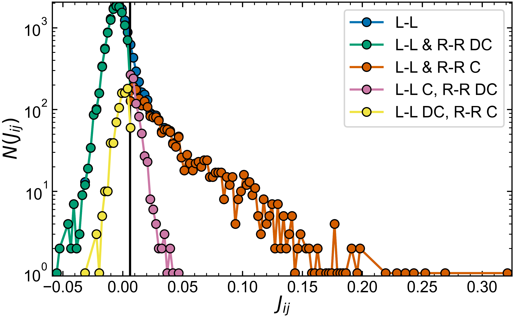
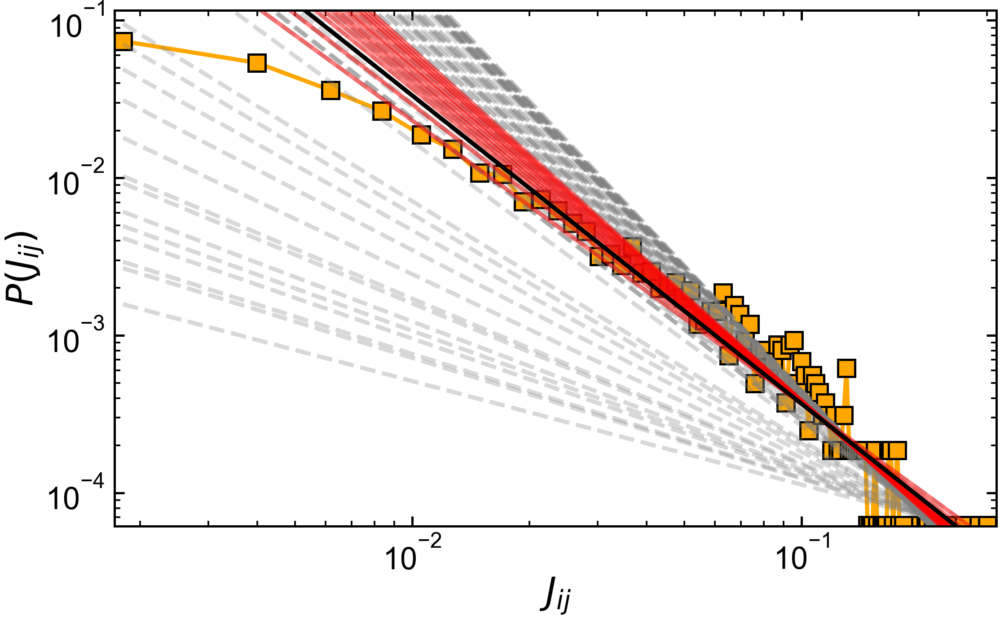

# HCP Resting State Notes (No Correction)

Here are the results from performing PLM inference on the HCP resting state dataset provided to me by Hiro. In total this dataset contains:
- 161 participants
- 4724 samples (B)
- 360 ROIs ,180 left, 180 right hemispheres (N)

I perform PLM on each individual, and on the grouped data (i.e. append all 161 x 4724 samples for each ROI). For the grouped data the B = 760,564. Comparing to only individual 0 at the moment, not averaging their distributions yet.
- Grouped data: GRP
- Individuals data: IND

# Inference overview (GRP)

## The Inferred Network

- The output of the inference is a parameter matrix, $\theta _{ij}$ where the diagonal elements contain the external fields $\theta_{i = j} = h_{i}$, and the off-diagonal elements contain the couplings $\theta_{i \neq j} = J_{ij}$.
- i={0-179} shows couplings within the left hemisphere (L-L), i={180-359} within the right hemisphere (R-R), and i={180-359} j={0-179} shows inter-hemisphere couplings (L-R)
- Find interesting property; there is a **high degree of symmetry between the two hemispheres**
- Evidence this in two ways
    - Parameters in L-L and R-R networks show a strong correlation with each other
    
    - Diagonal elements of L-R network are large, i.e. regions with the same i in L and R are functionally very strongly connected, and will activate in unison
    
    - Diagonal: $\mu_{i=j}=0.09 \pm 0.06$. Off-Diagonal: $\mu_{i \neq j}=0.00 \pm 0.01$.
    - The diagonal elements of L-R are largest in the matrix, i.e. strongest connected. Positive values mean excitatory, i.e. if one activates so does the other, no anti-correlations, ROIs on different sides tend to activate together and play a role in same function.
    
    - briefly comparing the LL and LR parameters gives us a feeling for how important the parameters in the inter and intra hemisphere networks are. Black line is tale threshold introduced below.
    
    - diagonal elements of L-R are by far largest params in network, i.e. these regions are quite ubiquitously coupled strongly.
    - the off diagonal elements in L-R are more weakly coupled than the off diagonals in L-L, meaning that they play a weaker role than the intra network couplings.
    - functional connectivity between hemispheres is therefore dominated by diagonal connections

- With the above in mind, I decide to analise the L-L and R-R intra hemisphere networks separately. **I can probably include L-R in all my analysis as long as I exclude the diagonal.**

## Intra-hemisphere networks (L-L and R-R networks)

Visually, we can see that the two networks are quite similar. I attempt to quantify this further in this section. To digest the information in the network we introduce a threshold, see below, which is based on the observation that the tail of the parameter distribution appears to follow a power law. All parameters below this threshold are set to 0, and are said to be ``disconnected''. This is therefore an analysis of the tail networks, i.e. the networks on both sides containing the strongest excitatory couplings.

**I'm currently not appropriately addressing the values on the diagonal. Should I times these by N / N^1/2? Discuss with T&F.**

We can then compare the similarity between the two tail networks, which we split into 4 categories:
- 0 : L-L and R-R both disconnected
- 1 : L-L and R-R both connected
- 2: L-L connected R-R disconnected
- 3: R-R connected L-L disconnected

And analyze where in the distribution of couplings these 4 categories sit.

We find that the connections found in both the L-L and R-R networks tend to sit far in the tail, **i.e the tail is a feature of both hemispheres**. Those which are missing from only one hemisphere, are small(ish) and are near the cut off, i.e. could be due to error / a property of the large gaussian core. The majority of couplings are found to be disconnected in both cases.

| condition | L-L & R-R DC | L-L & R-R C | L-L C, R-R DC | L-L DC, R-R C | TOTAL |
| --- | --- | --- | --- | --- | --- |
| $N_\theta(\text{condition})$ | 12266 | 2165 | 837 | 842 | 16110
| $N_\theta / N_T(\text{condition})$ | 0.761 | 0.134 | 0.052 | 0.0523 | 1.0 |

So the L-L & R-R networks above the cut-off are:
- $N_\text{L-L C} / N_T = 0.187$
- $N_\text{R-R C} / N_T  =0.187$

tail contains ~20% of the total parameters (I'm saying this as I don't want to discard the other parameters entirely, I don't know if they are real or play a significant role). Within each tail sub-network however, we additionally have that:
- $N_\text{ L-L C, R-R DC} / N_\text{L-L C} = 0.279$
- $N_\text{ L-L DC, R-R C} / N_\text{R-R C} = 0.280$

Moreover, I've had a double checked and it seems that L-L C, R-R DC / L-L DC, R-R C conditions share no members. I guess this makes total sense, because they can't be connected and disconnected simultaneously. Good that I sanity checked anyway!

So in **summary** what does all of this mean?
- The L-L and R-R sub-networks are of remarkably similar size: this is suspicious, why would this be?
- Within each subnet there is also a remarkably similar number of shared and non-shared ROIs. Again why should this be?
- The L-L & R-R C condition defines a robust subnet found in both hemispheres
- The other two conditions define variability between the hemispheres.

*Should maybe try to match the colors of my categorical matrix and the histograms with each category on them. Would make it more visually fluid.*

## Analyzing the shared sub-network
I'm doing a network analysis of the shared tail, varying the threshold to see how it changes. This is kinda working so far; using networkx.
I need to return my catagory in some way for this
Q: analysing the shared subnetwork, do a scaling analysis? need a function that gives me this subnetwork!

so the threshold variation changes the community structure right
that's what I wanted to see?
this whole in is a cluster fuck
I'll clean it up once I've got a grip on things
is this aretfact of the reshold? change it to 0 and see if netwokrs are more similar?
not sure what any of these plots tell me, but they're at least an interesting exploration + I can now use network x without any problems!
I wonder what the R2 of the shared tale is?

I should do one more check, see what happens to the two non-shared subnets if I change the threshold to 0; i.e. is it still as similar. I suppose it might be if the overall distributions look so similar?

What about the L-R network as well, currently i'm discounting a lot in this network..
See what are the most symmetric thingies by introdcuing the labels

I'm now starting to ask graph theory questions, so I should get a few things for say the 3 biggest connected networks as I vary the threshold?

PageRank works for directed networks; doesn't make sense here.
I want to compare to the LR highest as well once I've done my analysis!
I.e. how does community relate to symmetry?

so I get out my 3 biggest networks, and then for each of them I want to do a centrality analysis to get which node is most important or a community analysis within them.

my reasoning will be that because R2 is high I will analyse the average network as a reprensetaion of the symmetric network (i.e. average the coupligs between the two sides)

    I'VE SPOTTED AN ERROR!
    print(np.allclose(modL, mods[0]), np.allclose(modR, mods[1])) = FALSE, FALSE
    THIS MIGHT MEAN THAT MY OTHER RESULTS ARE SLIGHTLY OFF! NEED TO DOUBLE CHECK!
    As long as I used mods[0], mods[1] is ok. delete this loop for clarity I think!
    KEEP THIS IN MIND! YOUR THRESHOLD RESULTS MIGHT NOT BE RIGHT BECAUSE OF THIS LOOP!!!!
    delete this once fixed everywhere (which I don't think it currently is)

So I'm making a bunch of graphs of network properties at the moment, but I don't know what they mean or what they are telling me. I also want to look at the degree distribution! And I want to know what the most important node / nodes in the network are! e.g. by getting back all nodes > 0.8 * max measure.

I think I want to look at degrees or something before I split my network?
I'm not sure really... anyway it's an important measure
**Q: Currently I analyze the mean of the shared tail network. But is there any justification for this? What scientific question am I asking here? The question is: what is the overall shared structure seen in both hemispheres. I justify mean through high $R^{2}$ coefficient.**

## Analyzing the different sub-networks (i.e. non overlapping?)

# Distribution Features (getting a threshold)

## Comparing $J_{ij}$ distributions GRP vs IND(subject=0)
- I work with each hemisphere separately, number of ROIs is $N=180$
- GRP -> large B (~1e5-1e6) 
- IND -> small B (~1e3-1e4)

### Distribution of parameter values $P(J_{ij})$ (linear scale)

| SUMMARY-OBS | IND-L | IND-R | GRP-L | GRP-R |
| --- | --- | --- | --- | --- |
| $\mu_{J}N$ | 0.17 | 0.09 | 0.20 | 0.25 |
| $\sigma_{J} N^{1/2}$ | 0.45 | 0.52 | 0.28 | 0.27 |
| $\mu_{J}N / \sigma_{J} N^{1/2}$ | 0.37 | 0.17 | 0.71 | 0.92 |
| argmax($P(J_{ij})$) | -0.0013 | -0.0083 | -0.0057 | -0.0026 |

- IND (small B condition) is more spread, **almost twice as spread!**
- Corresponds to lower temperature state-point in SK formalism.
- Mean also shifts further positive
- Relevant variable in SK-PD is the ratio $\mu_{J}N / \sigma_{J} N^{1/2}$ -> ~1 in GRP
- Peaks of gaussian are negative, i.e. a large proportion of population is slightly inhibitory.
- Long positive tail is responsible for positive mean

### Cumulative distribution of parameter values $P(J < J_{ij})$ (linear scale)

| SUMMARY-OBS | IND-L | IND-R | GRP-L | GRP-R |
| --- | --- | --- | --- | --- |
| $P(J_{ij} < 0)$ | 0.53 | 0.54 | 0.65 | 0.66 |

split this once I know what's in the tail!
- So what does this reveal? The bias causes Jij population to look more symmetric about 0
- This makes sense if we think it "stretches" the tail
- In "reality" i.e. the large B setting (GRP), ~2/3 of the population of neurons is inhibitory. The other third is positive and sits in the tail
- Visual inspection of PDF shows that positive tail of coupling distribution follows a power-law like tail

### Fitting the Power Law tail:

- I vary the value $J_{\text{tail}}$ and fit a stragiht line to $y = log10(P(J_{ij}))$, $x = log10(J_{ij})$ for $J_{ij} > J_{\text{tail}}$
- I look at the $R^2$ values obtained for all these fits
- I pick the value of $J_{\text{tail}}$ which maximizes $R^2$
- Red lines show all fits, with $R^2 > 0.9$, black spot is best fit
- Curvature of $R^2$ is flat, meaning there is a reasonably large range of suitable fitting exponents, i.e. error, as shown by red points which satisfy the $R^2 > 0.9$ condition

### $P(J_{ij})$ distribution tail features

- Plotting $P(J_{ij})$ on a log-log axis shows that tail of coupling distribution looks like a straight line, i.e. a power law. Connects to criticality (sometimes)
- Can fit this power law and get exponents. Smaller (magnitude) exponents for GRP, i.e. as the parameters in IND are stretched the power law looks like it decays more slowly.
- Using the tail cut-off value $J_{\text{tail}}$ and the CDF above, I can see what the probability is that a coupling value lies in the tail

| SUMMARY-OBS | IND-L | IND-R | GRP-L | GRP-R |
| --- | --- | --- | --- | --- |
| $J_{\text{tail}}$ | 0.0198 | 0.0216 | 0.00606 | 0.00617 |
| $P(J_{ij} < J_{\text{tail}})$ | 0.792 | 0.796| 0.833 | 0.830 |

So for remaining analysis I want to return this cutoff value (use it to calculate N(J>Jtail), and r2mc to analyze the individual variation and compare it to the GRP values. so return Jtail and r2mc from my tail functions
- so distro of L/R seem very similar especially for GRP. Comment on this!

So for analysis i want tail to return J cuttoff + best fit params. I
For now I will define the tail as beginning where R2 is best for linear fit, i can clearly see that this is not super true though!

I won't analyse every distribution in detail for every individual..
I should have a look at the average vs the grped distros!

    analysing the matricies of the tails
    start by introducing matrix and that we can threshold it above
    then talk about the power law tails
    then talk about the tresholded stuff and the assymetries we find
    I can only do this in broad strokes at the moment

Thoughts for next week:
- When I'm compairng my tresholded models, a lot of the similariteis comes from LR both containing couplings that are not in the tail. So my ~10% measure reflects similarity of the whole network (including the couplings I've thresholded out)
- I should try to also see similarity only in tail, i.e. by masking and doing simlarity analysis on a flattend version of the array (i.e. excluding all the zeros / nans)
- look through comments in notes
- Final numbers will be a % whole network similarity and a % tail similarity
- tail issue is that couplings don't overlap i.e. iL might not be in tail in right. Rethink this, because what I've just written above now doesn't really make sense anymore...
- I will have to threshold in some what no matter what... I could do the analysis for Jth = 0 and Jth=Jtail and see how it changes?
- this is all very subjective at the end of the day. Maybe best I just stick with the simplest thing, which is similarity after threshold and only keeping the tail
- I.e. I regard couplings in the tail to be "real" and connected for this similarity analysis; although the strength of them may vary somewhat
- Put in the intro plots of the whole matrix where I identify that Mat(L) and Mat(R) look similar, **this is the basis of why I analyze the two hemispheres separately**

## Remaining Questions:
What if I infer each hemisphere separately?

**Q: what Number of neurons is in the tail? i.e. P(J > cutoff)?**
**Q: what is the exponent of the tail? + how many decades**
**Q: how do I determine if the couplings near zero are real/significant**
**Q: what happens to all these results when I do the correction -> not done for full case at the moment, too many samples!**
**Q: cluster network further to understand better?**

    # I'll want one more thing that looks at the differnet r2mcs for each individual
    # that will be another section: Individuals comparison
    # Need to fill in the ratio B/N thing to get an idea of how good my infenrece is?
    # this will be quite insighteful in the end I think!

    # I think I want to set them to the TH, 0 or NaN?
    # measure how different the two networks are?
    # just in terms of connectivity i.e. not strength of connectivity?
    # analyse this subnetwork?

    # I won't be able to recycle for multiple analysis
    # yes I can if I have option to stop plotting, and return NP and other measures!
    # I'm doing a lot here, maybe too much for one function / set of plots...
    # but it's ok, makes sense for now
    # next I want to compare "similarity" of networks
I STILL WANT A PLOT WHERE I COMPARE THE NETWORK TO WHAT THE CORRELATIONS WOULD IMPLY i.e. why is this better than simple functional connectivtiy networks

I can also still talk about the hs somehwere... which I currently igonre to be honest
# maybe tomorrow I work on the paper from my laptop...